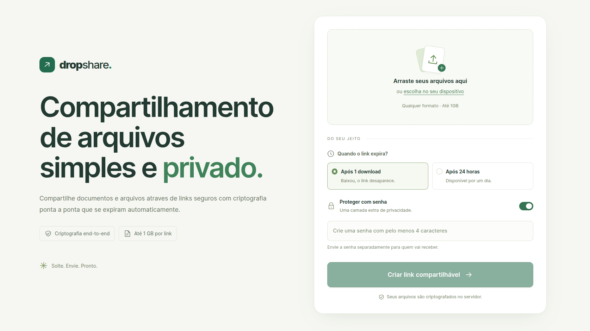

# Drop Share

Compartilhamento anônimo de arquivos zipados com criptografia AES-256-GCM.



## Como executar

```bash
bun install
cp .env.example .env
bun run dev
```

Abra `http://localhost:3000`.

Para produção, gere o cliente e inicie o servidor:

```bash
bun run build
bun run start
```

## Armazenamento e segurança

- ZIPs cifrados ficam em `storage/shares`; arquivos temporários em `storage/uploads`.
- Nunca armazene a senha: ela é usada para derivar a chave de criptografia com PBKDF2-SHA512 e um salt único.
- Sem senha, a chave é derivada de `SERVER_ENCRYPTION_KEY`. Trocar essa variável torna links antigos sem senha indisponíveis.
- O limite é 1 GB por compartilhamento (arquivos recebidos e ZIP final).
- A limpeza é feita ao iniciar, a cada 15 minutos e imediatamente depois de um download de uso único.

Use HTTPS, uma chave de servidor forte e um volume persistente em produção.
